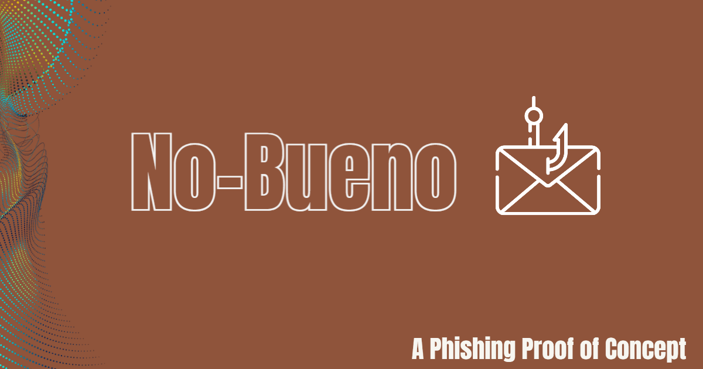

# No Bueno

No Bueno is intended to be a POC (proof of concept) for email spoofing. The goal of this application is to be able to send an email and impersonate someones identity. It does so by modifying the following paramaters in the email content,

- From
- Reply-to

Manipulating the from and reply to fields is possible because the SMTP protocol does not have a built in verification method. Some of the ways you can protect your self from an email using this kind of exploit would follow the below advice,

- Ensure that any email coming to you requiring immediate action you review and discuss inperson or over the phone with the person its coming from.
- Always double check the email headers, or view the origional email.
- Implement in your enterprise network anti spam filters.

You can read more about email spoofing from this great article on [https://cybernews.com/](https://cybernews.com/secure-email-providers/email-spoofing/) where they discuss what it is and how to prevent it in depth.

# Getting Started

This software is a Proof of Concept and is not developed to be used with malicious intent. The main reason I am writing this application is to practice my C# skills and convert the concept from python in my older project https://github.com/winters-brown/Malicious-Mailer.

## Dependencies

- .NET 6

### Development Dependencies 
- Mailkit 3.4.2
- Microsoft.Extensions.Configuration
- Microsoft.Extensions.Configuration.Json
- MAUI Framework

## Installation
Copy the sample_appsettings.json to where ever you are running your application. Once you have coppied it there, rename the file to appsettings.json and open it up. You will want to begin filling out the keys with appropriate values.

### Using GMail
To use your GMail, you will need to enable two factor authentication. From there you will then need to enable app passwords. Generate a app password and set the type as other, give it a memorable name, or not. And then use that password for when connecting to the smtp server.

# Contributing
No Bueno was written by Joshua Winters-Brown with the intent of practicing my c# abillities, If you have reccommendations or suggestions on the way things should be handled here please feel free to make a pull request or open an issue. In your pull request be sure to modify the contributers section to add your screen name.

## Contributers
- Joshua Winters-Brown
